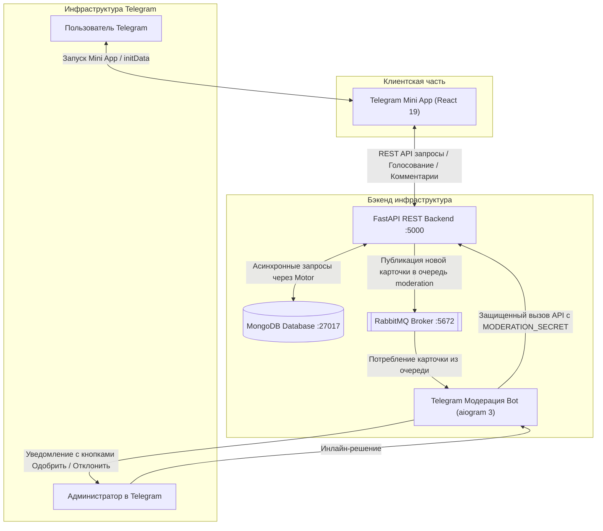

# this OR that | Telegram Mini App


## Описание проекта

[«this OR that»](https://t.me/thisorthat_rubot?startapp) — это интерактивное веб-приложение формата Telegram Mini App, предлагающее пользователю сделать выбор между двумя альтернативными вариантами («Это или То»). Сразу после голосования открывается статистика голосов других участников, открывается доступ к обсуждению в комментариях, реакциям (лайки / дизлайки), а также предоставляется возможность создать собственную карточку.

### Идея и источник вдохновения
Вдохновением для проекта послужил русскоязычный ресурс [thisorthat.ru](https://thisorthat.ru), где собраны тысячи вопросов для размышления. Основная цель данного проекта - адаптировать и переосмыслить эту механику в современный экосистемный формат **Telegram Mini App**.

> [!NOTE]
> **Это pet-проект.** Проект носит исключительно некоммерческий, учебно-исследовательский характер. Он был создан для отработки и демонстрации практических навыков проектирования асинхронных бэкендов, построения событийно-ориентированной архитектуры (Event-Driven Architecture), интеграции очередей сообщений, работы с Telegram WebApp API и контейнеризации сервисов.


## Технологический стек, подходы и инструменты

В ходе разработки были применены современные технологии, обеспечивающие высокую производительность, масштабируемость и безопасность:

### Backend & Асинхронная экосистема
* **Python 3.12+**: основной язык разработки сервисов.
* **[FastAPI](https://github.com/fastapi/fastapi)**: высокопроизводительный асинхронный веб-фреймворк для реализации REST API.
* **[Motor](https://github.com/mongodb/motor)**: асинхронный драйвер для интеграции с базой данных MongoDB.
* **[Pydantic v2](https://github.com/pydantic/pydantic)**: строгая валидация входящих и исходящих данных через типизированные схемы.
* **[aio-pika](https://github.com/mosquito/aio-pika)**: асинхронный клиент для взаимодействия с брокером сообщений RabbitMQ.
* **[aiogram 3](https://github.com/aiogram/aiogram)**: асинхронный фреймворк для Telegram-бота модерации.
* **[FastAPI-guard](https://github.com/rennf93/fastapi-guard)**: модуль rate limiting, защита от попыток проникновения, а также временная блокировка подозрительных IP-адресов.
* **[Loguru](https://github.com/Delgan/loguru)**: структурированное логирование.
* **[Pytest](https://github.com/pytest-dev/pytest)**: тестовый фреймворк для покрытия эндпоинтов, логики карточек и проверки безопасности.

### Frontend
* **[React 19](https://github.com/react/react)**: библиотека для построения динамичного пользовательского интерфейса (SPA).
* **Telegram WebApp API**: интеграция с окружением мессенджера (Haptic Feedback для тактильного отклика, автоматическая адаптация к системной теме Telegram, SafeArea и управление кнопками).
* **Vanilla CSS & Flexbox/Grid**: адаптивная верстка под любые размеры мобильных экранов, плавные микро-анимации, кастомные скроллбары и модальные окна без утяжеления сторонними CSS-библиотеками.

### Базы данных и очереди
* **[MongoDB](https://www.mongodb.com/)**: NoSQL база данных для гибкого хранения карточек, голосов пользователей, профилей и древовидных комментариев.
* **[RabbitMQ](https://www.rabbitmq.com/)**: брокер сообщений, обеспечивающий отказоустойчивую буферизацию задач между бэкендом и ботом модерации.

### Архитектурные подходы и паттерны
* **Event-Driven Moderation (EDA)**: отправка   предложенных пользователями карточек в очередь сообщений без задержек основного пользовательского API.
* **Zero-Trust авторизация через Telegram**: валидация подписи `initData` по алгоритму HMAC-SHA256 с использованием секретного ключа бота.
* **Защита API и Rate Limiting**: многоуровневая фильтрация запросов через FastAPI-guard с возвратом специализированных экранов блокировки на фронтенде при превышении лимитов.
* **Service-Oriented Architecture (SOA)**: разделение приложения на изолированные контейнеры: БД, брокер, API-сервис и бот.

---

## Архитектура проекта и взаимосвязь компонентов

Проект построен по сервисной архитектуре, где каждый компонент выполняет строго отведенную роль:



### Сценарии взаимодействия:
1. **Пользовательский сценарий:**
   - Пользователь открывает Mini App внутри Telegram. Приложение передает `initData`, которая верифицируется бэкендом.
   - Пользователь получает случайные пары карточек из MongoDB, делает выбор, голосует, оставляет комментарии и реакции.
2. **Пайплайн предложения и модерации карточек:**
   - Пользователь предлагает свою карточку через интерфейс приложения.
   - Сервис FastAPI сохраняет карточку в MongoDB со статусом ожидания и мгновенно публикует событие в очередь `moderation` брокера **RabbitMQ**.
   - Сервис **Telegram Bot** (aiogram) слушает очередь, получает карточку и пересылает ее в чат администратора (`TG_ADMIN_CHAT_ID`) с инлайн-кнопками «Одобрить ✅» / «Отклонить ❌».
   - Администратор принимает решение в Telegram. Бот выполняет защищенный внутренний запрос к API (`/card_accept` или `/card_reject`) с заголовком `MODERATION_SECRET`, после чего статус карточки в базе обновляется.

---

## Краткое руководство по запуску

Для запуска проекта на локальной машине потребуются установленные **Docker**, **Docker Compose** и **Node.js** (версии 18+).

### Шаг 1. Конфигурация окружения
Создайте файл переменных окружения `.env` в корне проекта на основе образца `.env_example`:

```bash
cp .env_example .env
```

Заполните ключевые параметры в `.env`:
* `TG_BOT_TOKEN` — токен вашего Telegram-бота от [@BotFather](https://t.me/BotFather).
* `TG_ADMIN_CHAT_ID` — ваш Telegram ID или ID чата для модерации карточек.
* `MODERATION_SECRET` — произвольная секретная строка для взаимодействия между ботом и API.
* При необходимости скорректируйте учетные данные MongoDB и RabbitMQ. Для локальной разработки без валидации Telegram `DEV_MODE` можно оставить равным `true`.

### Шаг 2. Сборка фронтенда
Соберите статическую версию React-приложения:

```bash
cd frontend
npm install
npm run build
cd ..
```

### Шаг 3. Запуск сервисов через Docker Compose
Запустите сборку и старт всех сервисов в фоновом режиме:

```bash
docker compose up -d --build
```

После завершения запуска будут активны следующие компоненты:
* **Backend API:** `http://localhost:5000` (документация Swagger доступна по адресу `http://localhost:5000/docs` при `DEV_MODE=true`).
* **Панель RabbitMQ Management:** `http://localhost:15672` (логин и пароль задаются в `.env`).
* **MongoDB:** порт `27017`.
* **Telegram Bot:** сервис подключится к Telegram и начнет обработку очереди модерации.

---

## Контакты

* **Автор:** Волочай Игорь (Igor Volochay)
* **Telegram:** [@VIAproger](https://t.me/VIAproger)
* **Email:** [pseudo.developer.ru@gmail.com](mailto:pseudo.developer.ru@gmail.com)
* **GitHub репозиторий:** [https://github.com/IgorVolochay/thisORthat](https://github.com/IgorVolochay/thisORthat)

---

## Благодарности

### Идейный вдохновитель
* **[thisorthat.ru](https://thisorthat.ru)** — оригинальный проект, послуживший источником вдохновения для идеи, концепции дилемм и механики выбора.

### Open-Source сообщество, библиотеки и фреймворки
Выражаю глубокую благодарность разработчикам и мейнтейнерам ключевых библиотек и инструментов, на которых построен проект.